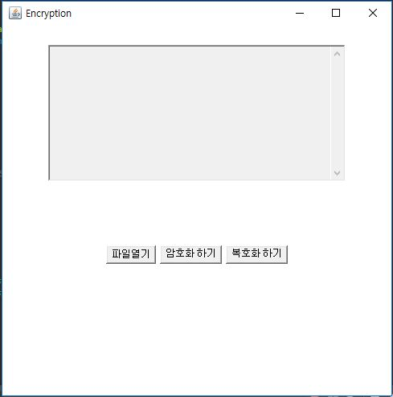
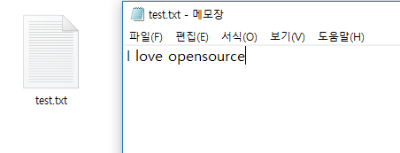
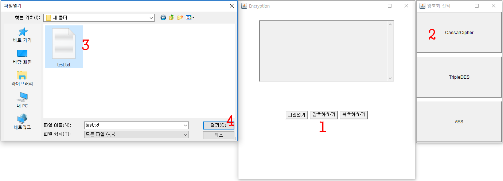
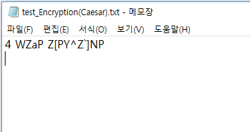
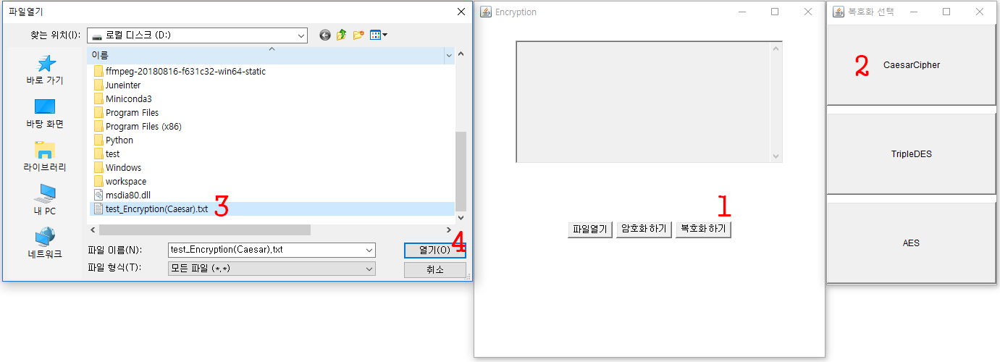
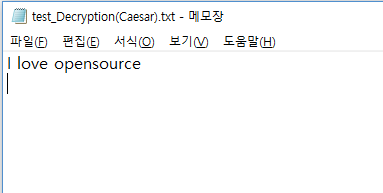

# git_sourtree
## hotfix
This repository is test repository for Source Tree.
edit on Github
 
## 시저 암호화 알고리즘 기능개선 및 추가
### 사용법
1. 메인화면  
  
2. 암호화  
암호화할 텍스트파일(.txt)을 만든다.  
  
암호화된 텍스트파일(.txt)을 프로그램을 통해 불러온다.  
  
암호화된 파일은 D드라이브에 저장된다.  
  
3. 복호화  
암호화된 파일을 프로그램을 통해 불러온다.  
  
복호화된 파일도 마찬가지로 D드라이브에 저장된다.  
  
